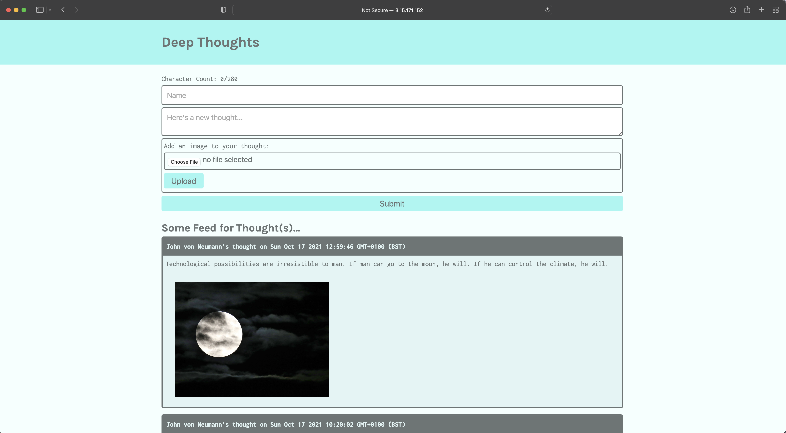
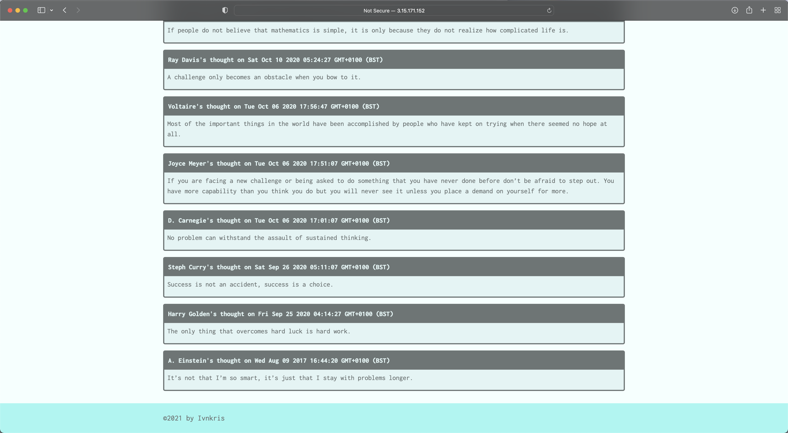

# AWS Deep Thoughts

## Description

In this project I have created a full-stack web application using REACT and Express.js for a Reddit type message board. The application is deployed to AWS, using EC2, S3 and DynamoDB.

## What I have done

- [x] Created DynamoDB data model and API endpoints
- [x] Integrated API Endpoints into the Front End and deployed DynamoDB to AWS
- [x] Integrated the Image Upload Feature to the UI using an S3 bucket
- [x] Created an EC2 instance, set up the EC2 environment using an Ubuntu server and deployed the application

## Contributing

Submit a pull request

## Link to GitHub repository

https://github.com/ivnkris/aws-deep-thoughts

## Link to deployed application

http://3.15.171.152

## Screenshots

## Questions

- Send any questions via my [GitHub profile](https://github.com/ivnkris)
